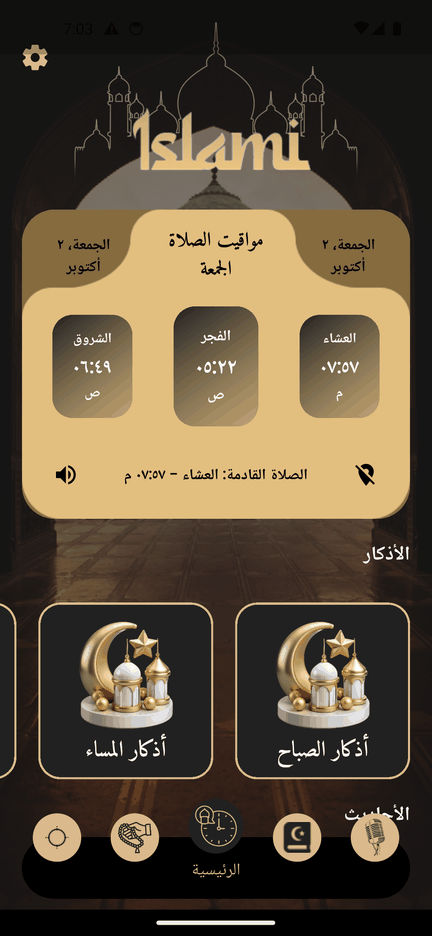
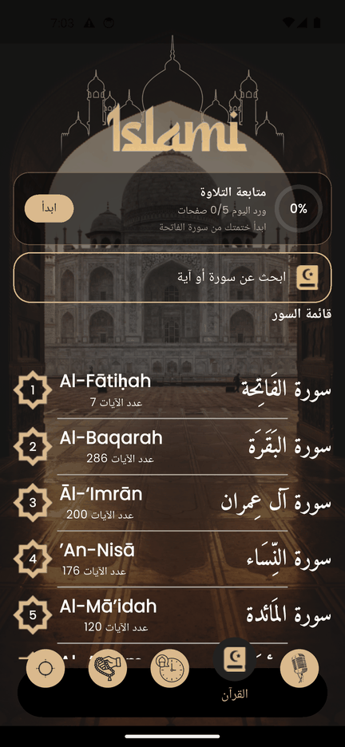
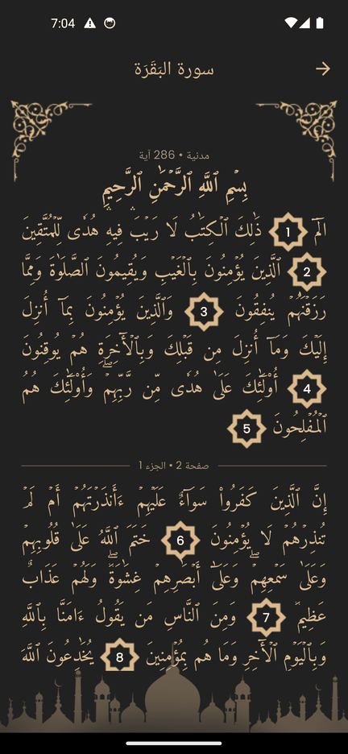
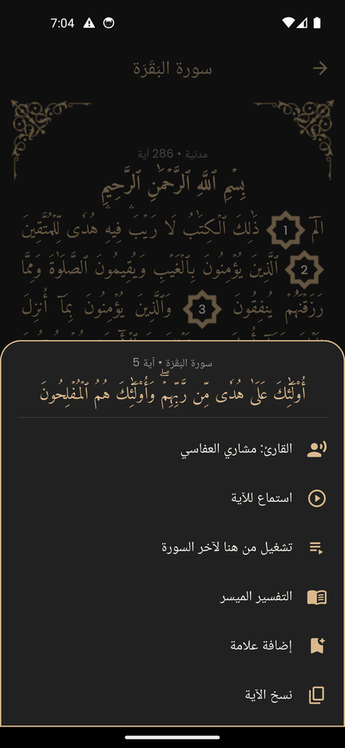
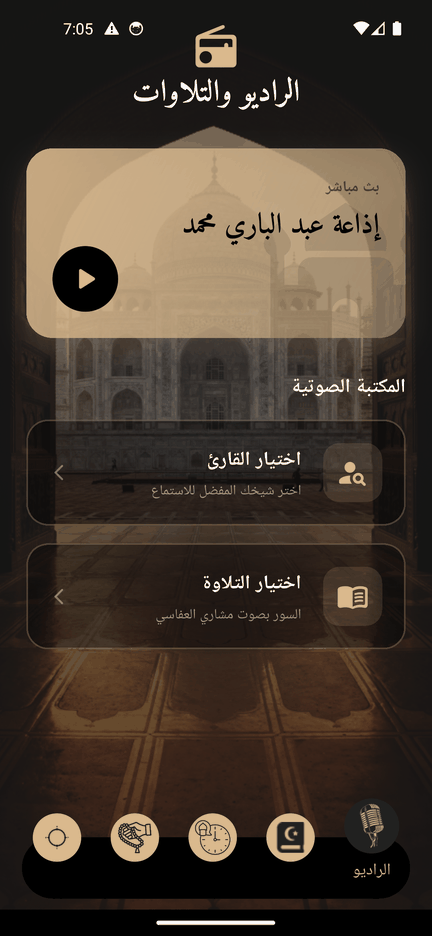
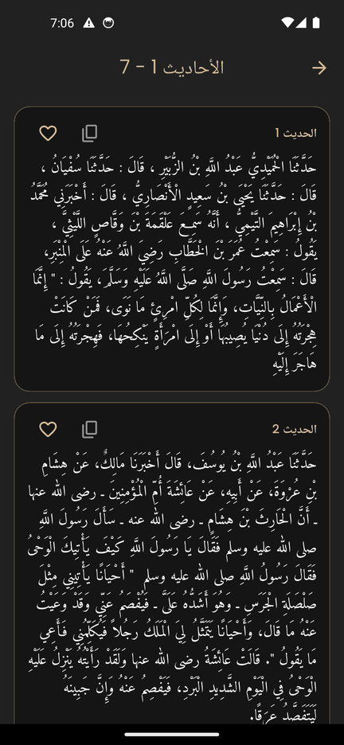
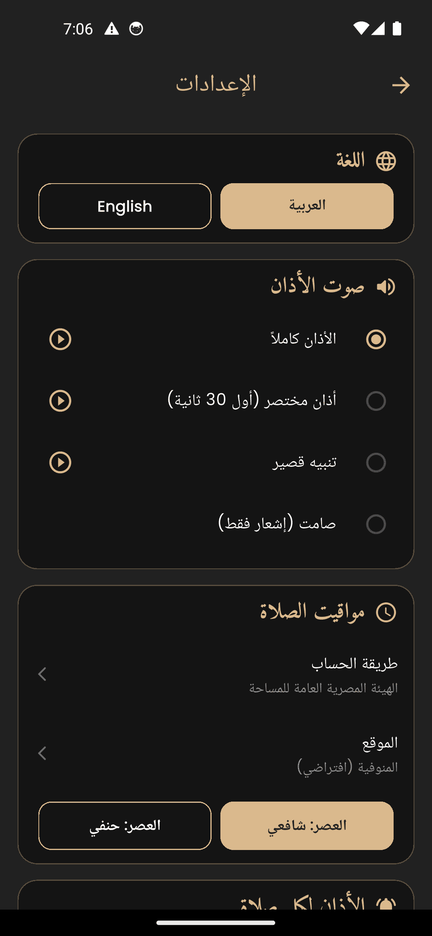
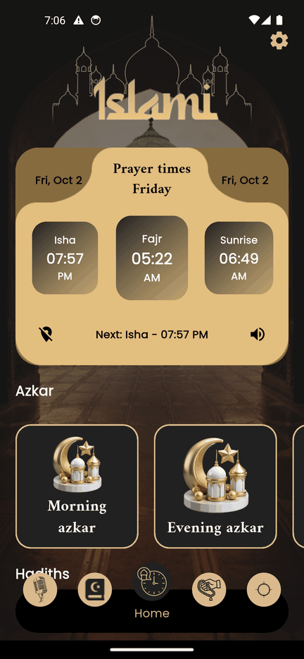

# Islami

A Flutter app for daily Muslim worship: the Holy Quran with tafsir and recitations,
prayer times with adhan notifications, azkar, hadith, a tasbih counter and the qibla
direction. Arabic first, with a full English translation.

<p dir="rtl">
تطبيق إسلامي: القرآن الكريم بالتفسير والتلاوات، مواقيت الصلاة مع الأذان، الأذكار،
الأحاديث، السبحة واتجاه القبلة. بالعربي والإنجليزي.
</p>

<p align="center">
  
  
  
  
</p>
<p align="center">
  
  
  
  
</p>

## Features

| Section | What it does |
| --- | --- |
| **Quran** | All 114 surahs in Uthmani script, laid out by mushaf page with page and juz numbers. Search surahs by Arabic or English name, or search inside the ayahs. Long-press any ayah to listen to it (20 reciters), play from it to the end of the surah, read the tafsir (Al-Muyassar), bookmark or copy it. Optional English translation (Saheeh International) under each page. |
| **Reading tracker** | Khatma progress, a daily wird goal with a 7-day chart and streak, "continue from last read" and bookmarks. A page only counts as read when its end stays on screen for a few seconds. |
| **Prayer times** | Calculated on the device from the user's location (or a chosen city) with a selectable method (Egyptian General Authority by default) and Asr madhab. Shows the next prayer. |
| **Adhan & reminders** | Adhan notification at each prayer with a choice of sound (full adhan, short adhan, short tone or silent), per-prayer switches, and an optional reminder 5–30 minutes before each prayer. |
| **Azkar** | Morning, evening, prayer, mosque, sleep azkar and more, with daily reminders for the morning and evening azkar. |
| **Hadith** | Sahih al-Bukhari, Sahih Muslim, the four Sunan, Muwatta Malik, An-Nawawi's 40 and the Qudsi hadiths, organized by chapter. Downloaded once per chapter and available offline after that. Favorites. Shown in English when the app language is English. |
| **Radio & recitations** | Live Quran radio stations, plus full recitations by hundreds of reciters and narrations (rewayat) with background playback and media controls in the notification. |
| **Tasbih** | Counter with history. |
| **Qibla** | Compass pointing to the Kaaba from the user's location. |
| **Settings** | Language (Arabic / English), adhan sound, calculation method, location, madhab, per-prayer adhan, reminders, Quran font size, default reciter, translation, about. |

## Getting started

Requirements: Flutter 3.41 or newer (Dart 3.10+), Android SDK, and Xcode for iOS.

```bash
flutter pub get
flutter run
```

Release builds:

```bash
flutter build apk --release        # or: flutter build appbundle --release
flutter build ios --release
```

Android application id: `com.marwansaif.islami`.

## Project structure

The app follows a feature-first layout. Each feature has `data` (sources, models,
repositories), optionally `domain` (abstract repositories and entities) and
`presentation` (views, widgets and Cubits).

```
lib/
├── main.dart                  startup, localization and theme
├── constants.dart             azkar files, Hive box names, preference keys
├── core/
│   ├── helper_functions/      app_router.dart (go_router routes)
│   ├── services/              app settings, audio player, notifications, get_it, shared prefs
│   ├── utils/                 colors, generated asset names, Quran text helpers
│   └── widgets/               shared widgets (app bar, ayah number, ...)
├── features/
│   ├── home/                  bottom navigation with the five tabs
│   ├── Quran/                 surah list, reading, search, ayah actions, reading tracker
│   ├── Timer/                 prayer times card, adhan scheduling, azkar
│   ├── Hadith/                hadith books, chapters, favorites
│   ├── Radio/                 live radio, reciters, recitations, mini player
│   ├── Sebha/                 tasbih counter
│   ├── Qibla/                 qibla compass
│   ├── settings/              settings page
│   ├── onboarding/            first launch introduction
│   └── splash/
├── l10n/                      intl_ar.arb, intl_en.arb (translations)
├── generated/                 generated localization code (do not edit)
└── hive_helper/               Hive adapters and field ids
```

Other folders:

| Folder | Contents |
| --- | --- |
| `assets/data/` | Azkar texts (JSON) |
| `assets/images/`, `assets/sound/` | Images and the adhan / notification sounds |
| `assets/google_fonts/` | Amiri and Poppins, bundled so text renders correctly offline (SIL OFL) |
| `android/app/src/main/res/raw/` | Notification sounds used by the Android channels |
| `ios/Runner/*.wav` | Notification sounds for iOS (max 30 s, so the adhan is shortened) |
| `test/` | Unit tests |
| `integration_test/`, `test_driver/` | Performance benchmark and UI audit (see Testing) |
| `design/unused_images/` | Design assets that are not used by the app |

## Data sources

| Data | Source |
| --- | --- |
| Quran text, tafsir, translation, page/juz/sajda data | [`quran_with_tafsir`](https://pub.dev/packages/quran_with_tafsir), bundled in the app |
| Ayah audio | [everyayah.com](https://everyayah.com) through `quran_with_tafsir` |
| Reciters and full recitations, live radio | [mp3quran.net API](https://mp3quran.net/api) |
| Hadith | [fawazahmed0/hadith-api](https://github.com/fawazahmed0/hadith-api) via jsDelivr, cached with Hive |
| Prayer times | [`prayers_times`](https://pub.dev/packages/prayers_times), calculated on the device |
| Qibla | [`flutter_qiblah`](https://pub.dev/packages/flutter_qiblah) |

## Tech stack

- **State management:** `flutter_bloc` (Cubit), plus `ValueNotifier` for app-wide settings
- **Navigation:** `go_router`
- **Dependency injection:** `get_it`
- **Storage:** `hive` (azkar settings, tasbih, reading progress, hadith cache and favorites), `shared_preferences` (settings)
- **Audio:** `just_audio` + `just_audio_background` (single player with notification controls), `audioplayers` for short previews in settings
- **Notifications:** `flutter_local_notifications` with `timezone`; one Android channel per adhan sound because a channel's sound can't change after it is created
- **Localization:** `intl` + `intl_utils` (ARB files)
- **Responsive UI:** `flutter_screenutil` (design size 395×825, portrait only)

## Localization

All UI text lives in `lib/l10n/intl_ar.arb` and `lib/l10n/intl_en.arb`. After editing them:

```bash
dart run intl_utils:generate
```

Use `S.of(context).key` in widgets, and `S.current.key` only where there is no `BuildContext`.
The language is switched from Settings and stored in shared preferences. The Quran text,
tafsir and azkar texts are always shown in Arabic.

## Testing

```bash
flutter analyze
flutter test                                   # unit tests
```

The integration tests run on a device or emulator:

```bash
# Opens every screen, sheet and dialog on several screen sizes, font scales and
# both languages, and fails if anything overflows. Needs internet for full coverage.
flutter test integration_test/overflow_test.dart -d <device>

# Startup and navigation benchmark (frame build/raster times), profile mode.
# Writes build/perf_*.timeline_summary.json
flutter drive --profile --no-dds --driver=test_driver/perf_driver.dart \
  --target=integration_test/perf_test.dart -d <device>
```

## Notes

- **Notifications.** Adhan and reminders are scheduled for the next 5 to 7 days every time the app opens, and survive a reboot. If the app isn't opened for a week, they stop until it is opened again.
- **iOS.** iOS allows 64 pending notifications and 30-second sounds, so iOS schedules fewer days and uses a shortened adhan.
- **App icon and splash.** `flutter_launcher_icons` and `flutter_native_splash` are configured in `pubspec.yaml`. Run `dart run flutter_launcher_icons` or `dart run flutter_native_splash:create` after changing them.

## Contributing

Work on a branch per feature (`feature/...`, `fix/...`, `perf/...`, `chore/...`), keep
`flutter analyze` and the tests green, and open a pull request to `main`.
